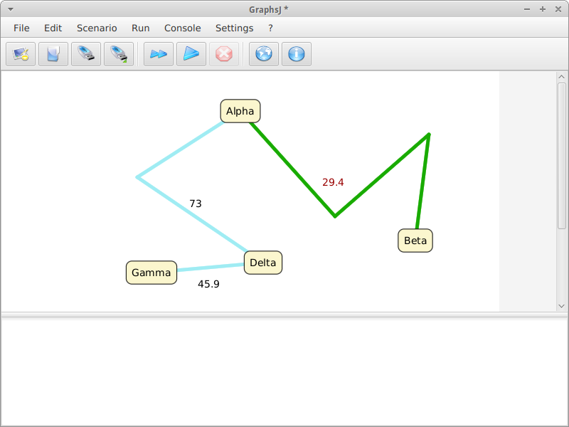
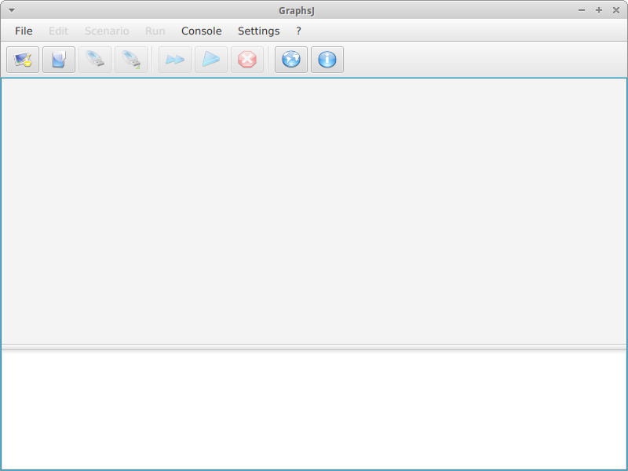
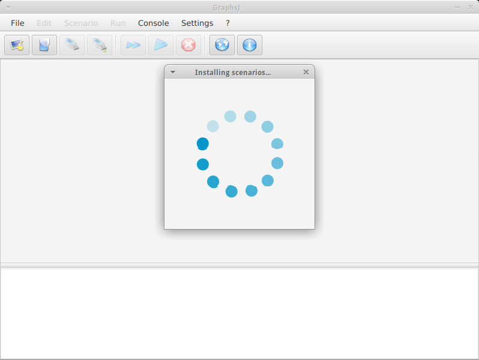

# GraphsJ

*ScalaFX didactic application for running graph algorithms*

## Introduction

GraphsJ is a modern didactic application dedicated to interactively executing graph algorithms; it features both a visual user interface and a Scenario Development Kit - to create *custom scenarios* based on the [EighthBridge](https://github.com/giancosta86/EighthBridge) toolkit for ScalaFX.

Students of Operations Research need to easily run graph algorithms, in order to study them with a practical, step-by-step approach: GraphsJ can meet this requirement for well-known algorithms - such as *Prim's Shortest Spanning Tree* - which often prove to be cross-subject.

On the other hand, researchers may want to test their algorithms on a PC, as it's faster and less error-prone, especially as the number of tests increases; unfortunately, writing a whole computer program only to test an algorithm is not always at hand - just the creation a GUI is a rather complex, time-consuming task.

GraphsJ satisfies both user groups, providing an easy-to-use interface as well as a minimalist Scala framework: people can therefore focus on the business logic making up their algorithms.

This new version, GraphsJ 4, is a ScalaFX-oriented redesign of the original architecture, introducing several concepts from Functional Programming; adding and removing scenarios is also extremely simplified: JAR files copied into a dedicated per-user directory will automatically and immediately provide new scenarios.

Finally, when no scenarios are installed, GraphsJ can automatically download the latest version of its scenarios pack directly from GitHub! ^\_\_^

## Features

* *Modern user interface*, employing **ScalaFX**

* *Flexible and vastly enhanced canvas* to draw and edit graphs

* ScalaFX-based **SDK**, enabling anyone to easily *create new scenarios*

* **Scenario-discovery engine**, *automatically adding and removing scenarios*

* **Automated installation of the predefined scenarios**, retrieved from [GraphsJ-scenarios](https://github.com/giancosta86/GraphsJ-scenarios)

* *Simplified model*, inspired by **Functional Programming**

* *Per-scenario options dialog and help*, customizable by scenario developers

* **XML-based document files**, to foster *interoperability and compatibility with previous versions*

* **Open source** code available: developers can create a new scenario starting from a consolidated base

## Requirements

Java 8u65 or later is recommended.

## Running GraphsJ

The suggested way to run GraphsJ is [MoonDeploy](https://github.com/giancosta86/moondeploy), as it will automatically download and launch the application - just go to the [latest release](https://github.com/giancosta86/GraphsJ/releases/latest) page and open the file **App.moondeploy**.

Otherwise, to start the application:
1. Download and decompress the zip archive
2. Run the file *bin/GraphsJ* (on UNIX) or *bin/GraphsJ.bat* (on Windows)

**Users who installed GraphsJ 3 via MoonDeploy can just run the program: MoonDeploy will automatically update it to GraphsJ 4**.

## Online help

GraphsJ features a very user-friendly interface, but ideas and suggestions can be found in the [wiki](https://github.com/giancosta86/GraphsJ/wiki)!

## Scenario development kit

For detailed information, please refer to the [SDK project page](https://github.com/giancosta86/GraphsJ-sdk).

## Screenshots

## Special thanks

The icons in the menu and toolbar are part of the [Crystal Clear icon set](https://commons.wikimedia.org/wiki/Crystal_Clear), by [Everaldo Coelho](https://en.wikipedia.org/wiki/Everaldo_Coelho).

Special thanks to:

* [Professor Silvano Martello](http://www.or.deis.unibo.it/staff_pages/martello/cvitae.html)
* [Claudia D'Ambrosio](http://www.or.deis.unibo.it/staff_pages/dambrosio/cv_claudia_english.htm)

for their suggestions.

## Further references

* [Facebook page](https://www.facebook.com/graphsj)

* [GraphsJ Scenario Development Kit](https://github.com/giancosta86/GraphsJ-sdk)

* [GraphsJ - Scenarios](https://github.com/giancosta86/GraphsJ-scenarios)

* [EighthBridge](https://github.com/giancosta86/EighthBridge)
